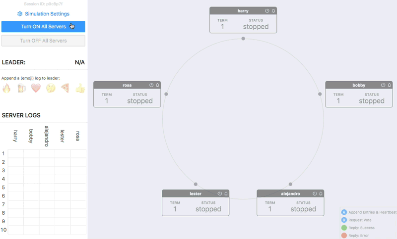

# stalk-demo-raft-consensus



This is a demo application, instrumented with OpenTracing API, which simulates *(a naive version of)* [Raft distributed consensus algorithm](https://en.wikipedia.org/wiki/Raft_(computer_science)). Heavily inspired by [ongardie/raftscope](https://github.com/ongardie/raftscope).

It can send traces to Jaeger and Zipkin backends.

## Running on Docker

#### Jaeger

```
docker run \
  --rm \
  --publish 8080:8080 \
  --env JAEGER_COLLECTOR="http://x.x.x.x:14268/api/traces" \
  dgurkaynak/stalk-demo-raft-consensus:latest
```

#### Zipkin

```
docker run \
  --rm \
  --publish 8080:8080 \
  --env ZIPKIN_COLLECTOR="http://x.x.x.x:9411/api/v2/spans" \
  dgurkaynak/stalk-demo-raft-consensus:latest
```

Then open up `http://localhost:8080` in your browser.

> If your Jaeger or Zipkin backend is running on the docker host machine, you need to use special `host.docker.internal` hostname ([more info](https://docs.docker.com/docker-for-mac/networking/#use-cases-and-workarounds)). So, your collector url would be:
> - For Jaeger: `http://host.docker.internal:14268/api/traces`
> - For Zipkin: `http://host.docker.internal:9411/api/v2/spans`

## Running from source

You need to have `node.js >= 10` installed on your machine.

- Clone the repo
- Install dependencies `npm i`
- Build `npm run build`
- Start the server
  - For Jaeger: `JAEGER_COLLECTOR="http://x.x.x.x:14268/api/traces" npm run start:backend`
  - For Zipkin: `ZIPKIN_COLLECTOR="http://x.x.x.x:9411/api/v2/spans" npm run start:backend`
- Open up `http://localhost:8080` in your browser
