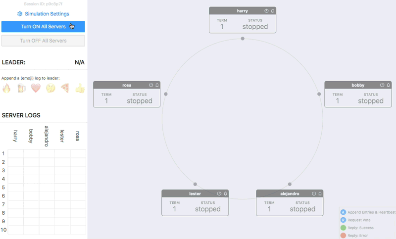
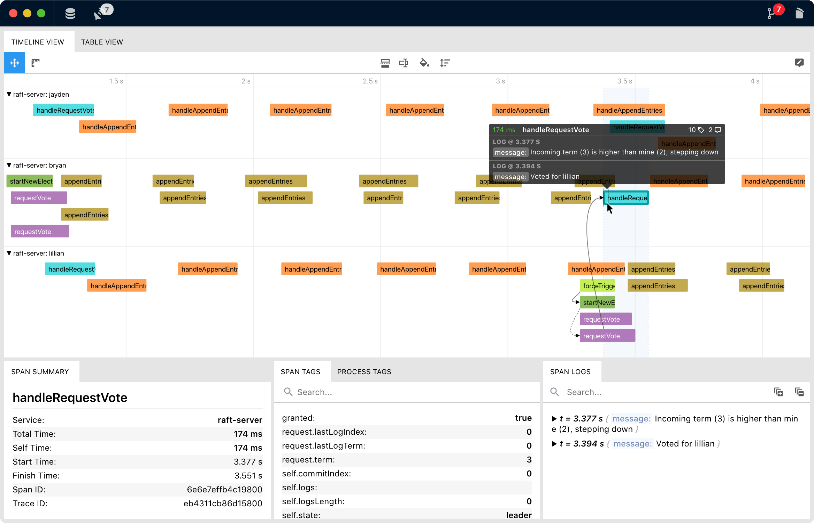

# stalk-demo-raft-consensus

This is a demo application, instrumented with OpenTracing API, which simulates *(a naive version of)* [Raft distributed consensus algorithm](https://en.wikipedia.org/wiki/Raft_(computer_science)). Heavily inspired by [ongardie/raftscope](https://github.com/ongardie/raftscope).

Available on: https://deniz.co/raft-consensus/

You can export traces to [Stalk](https://github.com/dgurkaynak/stalk) with one click to visualize & inspect collected traces.

# Building & Development

### Development

You must have node.js >= 12 installed on your machine.

- Clone the repo
- Install dependencies: `npm i`
- Get started with webpack-dev-server w/ live-reload: `npm run dev`

### Building

- Build the project in production mode: `npm run build`
- Check out `/dist` folder for output
